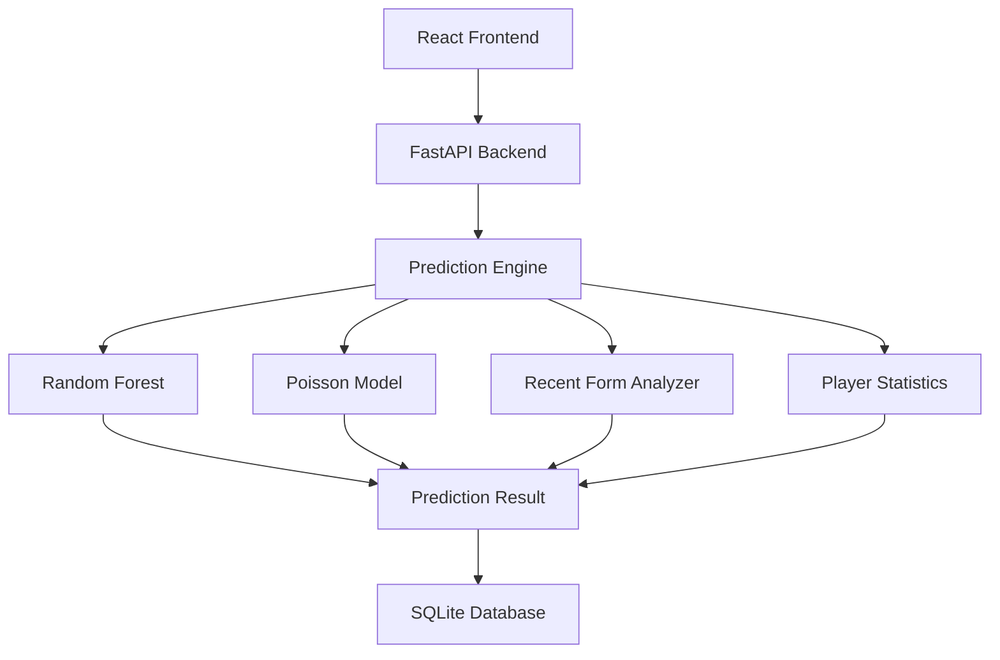
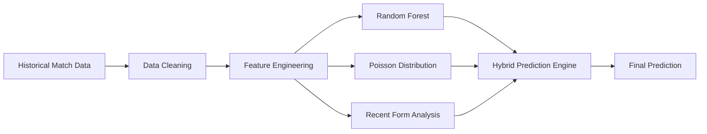

# ⚽ LaLiga Predictor Pro

<div align="center">


<h3>⚽ AI-Powered Football Match Prediction Platform</h3>

<p>
Predict LaLiga matches using a hybrid Machine Learning system combining
Random Forest, Poisson Distribution, Recent Form Analysis, and Advanced Football Analytics.
</p>

</div>

---

## 🚀 Overview

LaLiga Predictor Pro is a full-stack football analytics platform that predicts match outcomes and scorelines using a hybrid machine learning architecture.

The system combines statistical modeling, machine learning, team form analysis, player statistics, and historical performance data to generate intelligent football predictions with confidence scores.

### 🎯 Key Objectives

- Predict Match Winners
- Predict Scorelines
- Analyze Team Performance
- Evaluate Recent Form
- Compare Teams
- Track Prediction History
- Provide Explainable Football Analytics

---

## 📸 Screenshots

> Add your screenshots here

### Home Page


### Match Prediction


### Analytics Dashboard


### Prediction History


---

# 🏗 System Architecture



---

# 🧠 Machine Learning Pipeline



---

# ✨ Features

## ⚽ Hybrid Prediction Engine

Unlike traditional football prediction systems, this platform combines multiple prediction methodologies.

### Random Forest Model

- Match Outcome Prediction
- Historical Pattern Recognition
- Feature-Based Classification

### Poisson Distribution

- Goal Probability Calculation
- Expected Goals Prediction
- Scoreline Estimation

### Recent Form Analysis

- Last 5 Matches
- Momentum Tracking
- Team Strength Evaluation

### Head-to-Head Analysis

- Historical Matchups
- Rivalry Statistics
- Performance Trends

---

## 📊 Analytics Dashboard

### Team Comparison

- Goals Scored
- Goals Conceded
- Win Rate
- Draw Rate
- Loss Rate

### Performance Metrics

- Attack Strength
- Defensive Strength
- Recent Form
- Home Advantage
- Away Performance

---

## 📈 Prediction Insights

The platform provides:

✅ Match Winner Prediction

✅ Predicted Scoreline

✅ Team Form Analysis

✅ Goal Probabilities

✅ Confidence Score

✅ Historical Trends

---

# 🛠 Tech Stack

## Frontend

| Technology | Usage |
|------------|--------|
| React | UI Development |
| TypeScript | Type Safety |
| Tailwind CSS | Styling |
| Axios | API Communication |
| Vite | Build Tool |

---

## Backend

| Technology | Usage |
|------------|--------|
| FastAPI | REST API |
| Python | Core Backend |
| SQLAlchemy | Database ORM |
| Pydantic | Validation |
| Uvicorn | ASGI Server |

---

## Machine Learning

| Technology | Usage |
|------------|--------|
| Scikit-Learn | ML Models |
| Random Forest | Outcome Prediction |
| Poisson Distribution | Goal Prediction |
| NumPy | Numerical Computing |
| Pandas | Data Processing |

---

## Database

| Technology | Usage |
|------------|--------|
| SQLite | Prediction Storage |

---

# 📂 Project Structure

```bash
laliga-predictor-pro/

├── backend/
│
├── main.py
├── predictor.py
├── rf_model.py
├── poisson_model.py
├── form_analyzer.py
├── player_data.py
├── scraper.py
├── database.py
│
├── src/
│
├── components/
├── pages/
├── hooks/
├── assets/
├── data/
│
├── public/
│
├── package.json
├── requirements.txt
└── README.md
```

---

# ⚙ Installation

## Clone Repository

```bash
git clone https://github.com/deepmondal1818/laliga-predictor-pro.git
```

```bash
cd laliga-predictor-pro
```

---

## Backend Setup

```bash
cd backend
```

Create Virtual Environment

```bash
python -m venv venv
```

Activate

### Windows

```bash
venv\Scripts\activate
```

### Linux / Mac

```bash
source venv/bin/activate
```

Install Dependencies

```bash
pip install -r requirements.txt
```

Run Server

```bash
python main.py
```

Backend:

```bash
http://localhost:8000
```

---

## Frontend Setup

```bash
npm install
```

```bash
npm run dev
```

Frontend:

```bash
http://localhost:5173
```

---

# 📡 API Endpoints

## Get Teams

```http
GET /api/teams
```

---

## Predict Match

```http
POST /api/predict
```

Request

```json
{
  "home_team": "Barcelona",
  "away_team": "Real Madrid"
}
```

---

## Prediction History

```http
GET /api/history
```

---

## Refresh Dataset

```http
POST /api/refresh
```

---

# 🧪 Example Prediction Response

```json
{
  "home_team": "Barcelona",
  "away_team": "Real Madrid",
  "predicted_winner": "Barcelona",
  "predicted_score": "2-1",
  "confidence": 82.4,
  "home_win_probability": 62,
  "draw_probability": 18,
  "away_win_probability": 20
}
```

---

# 🎯 Project Highlights

### ✔ Hybrid AI Architecture

Combines:

- Random Forest
- Poisson Distribution
- Recent Form Analysis
- Team Statistics

### ✔ Full Stack Development

- React Frontend
- FastAPI Backend
- Database Integration
- REST APIs

### ✔ Machine Learning

- Feature Engineering
- Classification Models
- Statistical Modeling
- Confidence Scoring

### ✔ Data Analytics

- Team Performance Analysis
- Historical Insights
- Football Statistics

---

# 📈 Future Improvements

- Live Match Data API
- Injury Tracking
- Expected Goals (xG)
- Deep Learning Models
- Multi-League Support
- User Authentication
- Docker Deployment
- CI/CD Integration
- Cloud Deployment (AWS)

---

# 📚 Learning Outcomes

This project demonstrates:

- Full Stack Development
- Machine Learning Engineering
- Data Processing
- Feature Engineering
- Statistical Modeling
- API Development
- Database Design
- Software Architecture

---

# 👨‍💻 Author

## Deep Mondal

**Full Stack Developer | Machine Learning Enthusiast**

📧 deepmndl2003@gmail.com

💻 GitHub: https://github.com/deepmondal1818

---

<div align="center">

### ⭐ If you found this project useful, consider giving it a Star ⭐

🚀 Built with React, FastAPI, Machine Learning & Football Analytics

</div>
